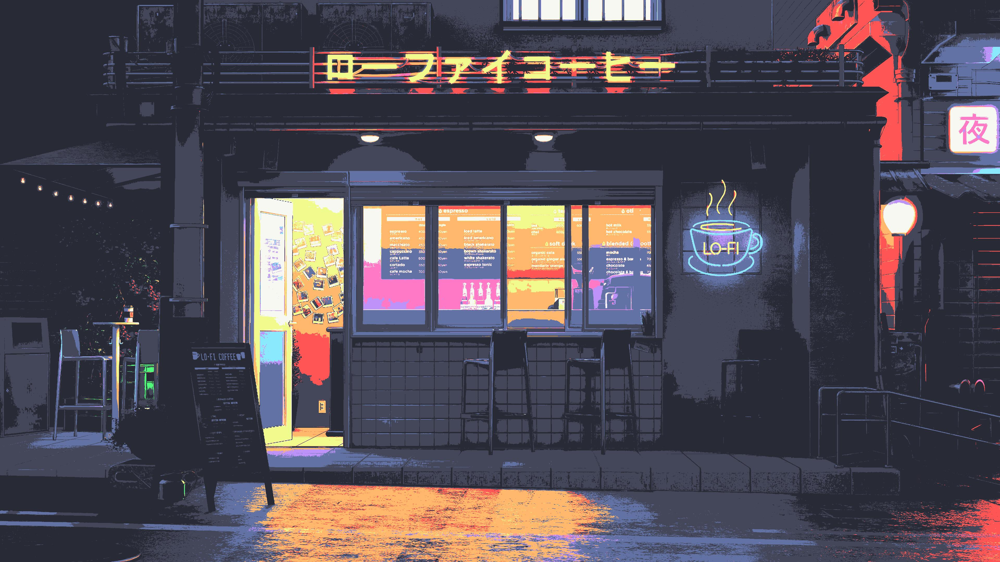
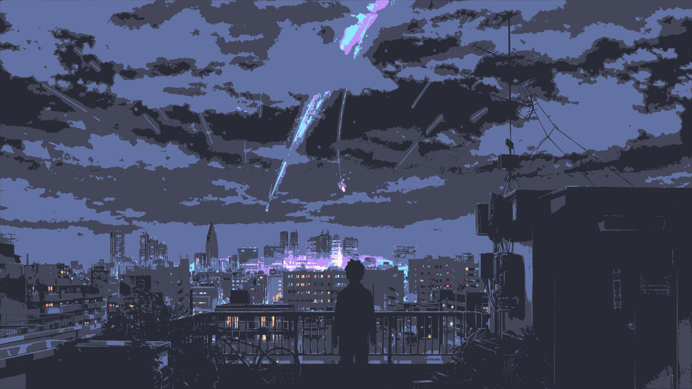

# ImageGoNord API

Due to the lack of Dracula themed wallpapers, I decided to create a simple API that converts images to the Dracula color palette.

The project consists of a Flask API that uses the [ImageGoNord](https://github.com/TylerYep/ImageGoNord) library to convert uploaded images to the [Dracula](https://draculatheme.com/) color palette.

## Examples





## Installation

1. Clone this repository to your local machine.
2. Install the required modules using `pip install -r requirements.txt`.
3. Run the Flask app using `python main.py`.

## Usage

You can use `curl` to test the API by sending a POST request with an image file. Here's an example command:

```bash
curl -X POST -F "file=@/path/to/image.jpg" http://localhost:5000/convert --output converted.jpg
```

Replace `/path/to/image.jpg` with the actual path to your image file. This command sends a POST request to the `/convert` endpoint of the API with the image file as a form field. The API will convert the image using the Nord color palette and return the converted image file as a response.

You can modify the color palette and colors used by the API by modifying the `GoNord` instance in `main.py`. The default palette and colors are:

```python
go_nord.reset_palette()
go_nord.add_color_to_palette('#282a36')
go_nord.add_color_to_palette('#44475a')
go_nord.add_color_to_palette('#F8F8F2')
go_nord.add_color_to_palette('#6272A4')
go_nord.add_color_to_palette('#BD93F9')
go_nord.add_color_to_palette('#8BE9FD')
go_nord.add_color_to_palette('#50FA7B')
go_nord.add_color_to_palette('#FFB86C')
go_nord.add_color_to_palette('#FF79C6')
go_nord.add_color_to_palette('#FF5555')
go_nord.add_color_to_palette('#F1FA8C')
```

> You can add or remove colors from the palette by calling `go_nord.add_color_to_palette()` or `go_nord.remove_color_from_palette()`, respectively.

## License

This project is licensed under the MIT License. See the [LICENSE](LICENSE) file for details.
